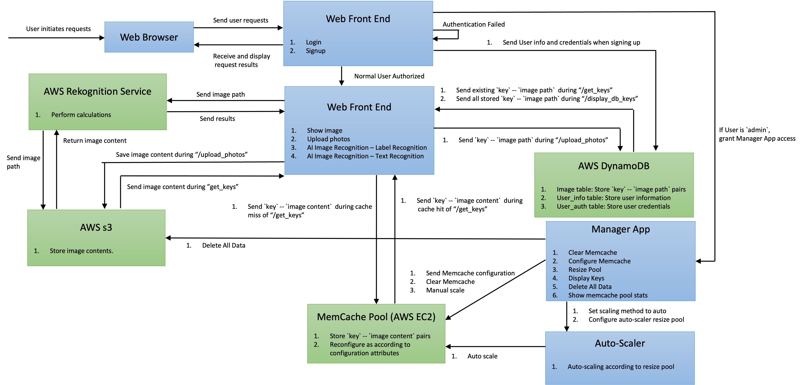

# Cloud Computing Applications with AWS
Yih CHENG (https://github.com/chengyih001) 

## Overview
This is the repository for University of Toronto course ECE1779 Cloud Computing. In this repository, three projects are included. In the first project, we implemented a web application allowing the user to upload and retrieve photos. Caching and Statistics are recorded by the application. In the second project, we expanded on project 1 to to utilize AWS S3, RDS databases, and EC2 instances for auto-scaling. Workloads are distributed to various nodes according to preset rules and MD5 hashing keys. In the third project, we further included functionalities such as user login and authentication. A public URL was deployed with AWS Route 53 and ACM. Last, AWS Rekognition AI was included to provide further information of the image to the user, which can also serve as accessibility tools for those in need. Project details can be referenced in each project's report. The following section will only include the architecture of the final product.

## Main Components
### Front End:
Upon first visiting the website, the user will be prompted to sign up an account. With every new sign up, the user info along with credentials will be stored into AWS DynamoDB. The user credentials will be MD5-hashed before storing to prevent database info leaking. In addition, an admin account can be setup in the database directly through personals with IAM permissions. Logging in to the admin account allows the admin to control the manager app, which includes critical configurations and stats visualization. Further details will be illustrated in the manager app section later.

The front end also allows users to upload and retrieve photos previously stored. The user can also choose to label the image or translate the image to text. This will trigger the AWS Rekognition Service and return the results. When a user uploads an image, the image content itself will be stored into AWS S3, a key-value pair of 'key'-'imageContent' will be stored into MemCache, and a key-valu pair of 'key'-imagePath' will be stored into DynamoDB. 

### Storage
There are two storage components in our system, being AWS DynamoDB and AWS S3.

AWS S3 stores the image content. Whenever a request for a image is sent, it returns the image content to the source.

We utilized AWS DynamoDB as our database to store user information and image metadata. User information and credentials are stored in different tables, with the credentials table storing the hashed passwords. The image table stores key-value pair 'key'-'imagePath'. Whenever a cache miss happens, we refer to this table for the image path in S3, then retrieve the image contents from S3.

There should be one-to-one relationship between each key-valu pair and the image contents stored in S3.

The image table schema are shown below.

Image Table:

| User_id (Primary Key) | Image Key (Sort Key, Unique for same User_id) | Image Path |
|---------------|-------------------------------------|------------------|
| The User_id, i.e. the current user’s session. This allows the backend to correctly identify individual users.  | Image Key the user setup. No duplicated image keys are allowed under same User_id. | The respective path in s3 to find the image content. |

### MemCache
MemCache is utilized to boost performance according to locality. It stores key-value pairs 'key'-'imageContent', which during a cache hit, allows the application to retrieve the image without requesting from the database. MemCache will send its stats to AWS CloudWatch per five seconds, including number of key-value pairs, total size, hit/miss rate etc. We deploy each MemCache on a seperate EC2 instance.

### Manager App
The manager app is for the admin to control various properties and perform custom configurations on the system. These actions have critical impact on the system's performance, scalability and availability.

There are 5 operations the admin can perform.

1. Configure MemCache attributes: This includes capacity (in MB) and replacement policy. The admin can choose between Random Replacement (RR) / Least Recently Used (LRU) for the replacement policy.

2. Resize Pool: In manual mode, resizing of the memcache pool depends on the set values. In auto-scaling mode, the admin can configure the Min/Max Cache miss rate threshold and the ratio by which to expand/shrink the pool.

3. Display MemCache stats: Visualization of memcache stats such as hit/miss rate, number of nodes etc are shown in AWS CloudWatch.

4. Clear MemCache data: The admin can reset all MemCache in the system and flush all data out of cache.

5. Database backup: The admin can perform manual database backup. The backup will only store user info and credential tables.

### Auto-Scaler
Scales MemCache pool according to manager app. The cache hit/miss rate is calculated per minute. Auto-Scaler is turned on only when resize mode is set to auto by admin.

## Application Cloud Architecture

  

### Database CRUD operations
All operations of the database is implemented with AWS serverless Lambda. An example is shown below:
Login event: User enters username and password --> Application hashes the password --> Application calls lambda function with parameters {username, hashed password} --> Lambda function checks database for user credentials --> if found: check with hashed password; if not found: Create response --> Lambda function sends result back to Application --> Application acts according to result.

### Custom Domain
The whole system was deployed on a custom domain with a public URL https://ece1779-a3-test.com with Route 53 and ACM for security. We Route 53 acts as the DNS server to route traffic to the Application Load Balancer (ALB). The ALB then distributes the workload to various EC2 instances hosting the website.

## Cost Model
The cost model is calculated with AWS pricing calculator under US-East-1 region. We assumed 100 total requests per user per day.

| User           | Service             | Upfront | 6 months | Configuration              |
|----------------|---------------------|---------|----------|----------------------------|
|1000 Users/month|Lambda               |0        |79.68     |100 invocations/day per user|
|                |DynamoDB provisioning|180      |261.84    |Reserved: 1 Year; Size: 10GB|
|                |EC2                  |0        |630.72    |10, t2.small                |
|                |AWS Rekognition      |0        |300       |50,000 invocations/month    |
|                |Route 53             |0        |10.2      |1 Hosted Zone               |
|                |S3 standard          |0        |1,413.48  |10 TB / month (2MB/image)   |
|1M Users/month  |Lambda               |0        |79,691.82 |100 invocations/day per user|
|                |DynamoDB provisioning|180      |1,782.84  |Reserved: 1 Year; Size: 1TB |
|                |EC2                  |0        |1,257.06  |10, t2.medium               |
|                |AWS Rekognition      |0        |155,700   |50,000,000 invocations/month|
|                |Route 53             |0        |4,803     |1 Hosted Zone               |
|                |S3 standard          |0        |132,403.56|1,000 TB / month (2MB/image)|